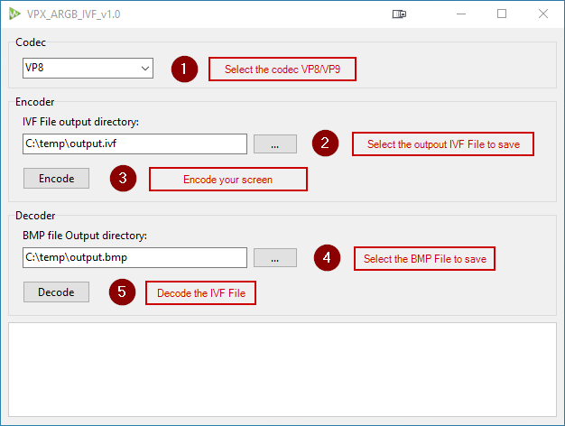

# libvpx-Delphi

Library for encoding 32 bits bitmap images using VP8 or VP9 codecs and decoding IVF files to 32 bits bitmap images.
The main headers of [libvpx by Google](https://github.com/webmproject/libvpx) have been converted.

This works binding the libvpx and libyuv dynamic link library.

The necessary DLL files are made available in this repository.

# Usage
1. Add to your project the `codec` folder.
2. Add DLL files from the `bin` folder in the same location as the executable.
3. Add to your main unit the `VPXEncoder.pas` and `VPXDecoder.pas`

```pascal
uses
VPXEncoder,VPXDecoder;
```
### Encoding
```pascal
var
  Encoder: TVpxEncoder;
  EncodedStream: TMemoryStream;
  Bitmap: TBitmap;
begin
  Encoder := TVpxEncoder.Create(vctVP8); //vctVP9 for VP9 
  try
    Bitmap := TBitmap.Create;
    try
      Bitmap.LoadFromFile('C:\temp\sample.bmp');
      EncodedStream := Encoder.Encode(Bitmap);
      try
        EncodedStream.SaveToFile('C:\temp\output.ivf');
      finally
        EncodedStream.Free;
      end;
    finally
      Bitmap.Free;
    end;
  finally
    Encoder.Free;
  end;
```
### Decoding
```pascal
var
  Decoder: TVpxDecoder;
  InputStream: TMemoryStream;
  OutputBitmap: TBitmap;
begin
  Decoder := TVpxDecoder.Create;
  try
    InputStream := TMemoryStream.Create;
    try
      InputStream.LoadFromFile('C:\temp\output.ivf');
      OutputBitmap := Decoder.Decode(InputStream);
      if Assigned(OutputBitmap) then
      begin
        try
          OutputBitmap.SaveToFile('C:\temp\output.bmp');
        finally
          OutputBitmap.Free;
        end;
      end;
    finally
      InputStream.Free;
    end;
  finally
    Decoder.Free;
  end;
```


## Demo

In the demo folder a GUI example to encode screen capture to IVF and decode the IVF to bitmap.

<p align="center">
  
</p>

## WebM documentation

https://www.webmproject.org/docs/


# Contributing

Contributions are welcome! If you have suggestions or bug fixes, please fork the repository and submit a pull request.


<p align="center">Made with ❤️ using Delphi RAD Studio</p>
